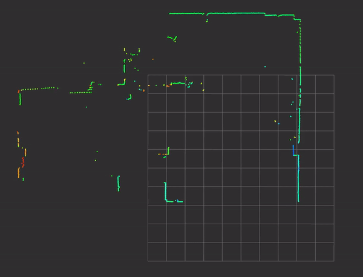
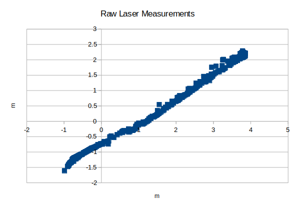
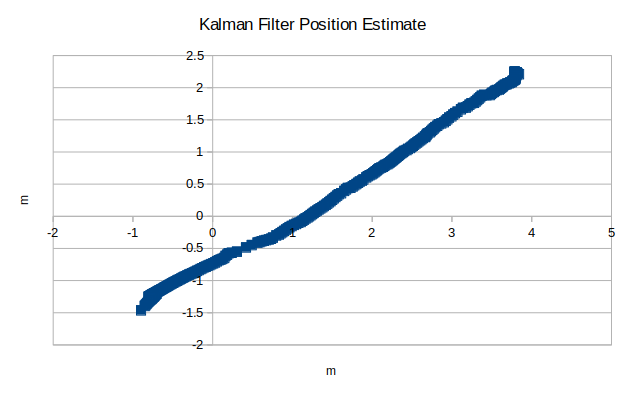

# 2D Object Tracking using a Kalman Filter

<p align="center">

</p>

## Introduction
The objective of this project is to track the moving object as seen in the point cloud data shown above. The point cloud data is from a robot stationed at the corner of a room. A LASER range scanner is mounted on the robot which is recording the environment around it. Apart from the robot, there is an additional object that is moving in the room. The object is moving in a straight line as seen from the point cloud data. In this project, based on the movement of the object and the sensor measurements from the LASER range scanner the position of the moving object is estimated and its velocity is inferred.

Detecting the moving object from the point cloud data is not covered in this project. For analyzing the point cloud and filtering out the object, point cloud library (PCL) was used. Additional information along with the relevant code can be provided for reference.

My submission contains the following files and folders:
* kalman_filter.h - Predict and update functions along with the state variables
* kalman_filter.cpp - Implementation of the predict and state functions
* tracking.h - Header file for tracking which uses the kalman_filter .cpp and .h files
* tracking.cpp - Actual implementation of tracking problem
* main.cpp - Entry point into the project
* measurement_package.h - Header file to handle the LASER measurements
* observations.csv - Distance measurement of the detected object along with timestamp
* CMakeLists.txt - Instructions to build the project using CMake
* Eigen/ - Library for performing linear algebra
* media/ - Media files required for README.md
* README.md - README file with the project description and build instructions


## Object Tracking using a Kalman Filter
A Kalman filter is a method used for state estimation in wide variety of problems. Because of this nature it is also very extensively used in robotics for state estimation in case of a noisy process and sensor measurements. Kalman filter is an iterative process which works in two phases; prediction and update. 

In this case, equations of motion for an object travelling in a straight line are used for the prediction step and measurements recorded by the LASER range scanner are used for the update step. Based on the amount of uncertainty because of state prediction and noisy sensor data a Kalman gain is calculated. This gain decides which of the two steps should be trusted more and the state of the object is estimated. The following section goes over the prediction and update steps used in this project.

### Prediction Step
Since the object is moving in a straight line as seen from the point cloud data, a constant velocity motion model is implemented. Hence, the state of the object is modeled as 

X<sub>t</sub> = [x, y, v<sub>xt</sub>, v<sub>yt</sub>]<sup>T</sup>

For modeling the state transition matrix the equation x<sub>t + 1</sub> = x<sub>t</sub> + v<sub>xt</sub> * dt is used. Since the motion of the object is in a real world, there is an uncertainty because of the environmental noise which is introduced in the system. This uncertainty in its position and velocity is because of factors like irregualar surfaces, wind resistance, irregular motor torque, debris on the road surface etc. which is not taken into consideration in the above equation. Therefore, this uncertainty is modeled as acceleration in a form of a normal distribution with 0 mean and covariance `Q`. The initial state covariance matrix is named `P` where the noise covariance is added. Consecutive timestamps from the measurement values are used to calculate `dt` which is then used for calculating the `P` and `Q` matrices.

### Update Step
In the Kalman filter update step, the measurements recorded by the LASER range scanner are taken into consideration. The predicted state is first compared with the measurements to calculate the error. To compare the predicted state, a measurement matrix `H` is defined which applies a transformation from the sensor space to the object space. In this case, since the LASER range scanner is not able to measure the velocity of the object it is represented as 0 in the `H` matrix. The sensor is also not accurate and has errors in its measurements which are represented as measurement covariance matrix `R`. These values are provided by the sensor manufacturer. Using the `H` and `R` matrices the Kalman gain, `K` is calculated which is then used to estimate the final state mean and covariance which will be used in the next prediction step and the process continues.

The measurements from the LASER range scanner associated with the moving object are saved in the `observations.csv` file. The measurements are formatted as follows:
```
timestamp,x-position,y-position
```
The LASER range scanner used in this case is a Hokuyo UAM-05LP-T301. The LASER range data is converted into a point cloud using Robot Operating System (ROS) and then the Point Cloud Library (PCL) is used to detect the point cloud associated with the moving object. 

## Build Dependencies
- cmake version 2.8 or above ([click here for installation instructions](https://cmake.org/install/))
- make version 4.1 or above
- g++/gcc version 5.4 and above

## Build Instructions
### Ubuntu
```bash
git clone https://github.com/sumukhpatil/2D-Position-Estimation-using-Kalman-Filter.git
cd 2D-Position-Estimation-using-Kalman-Filter
mkdir build && cd build
cmake ..
make
./KF_Tracking
```

The state mean and covariance matrices are printed on the console after running the executable. To save the position estimates to a csv file uncomment line 4 in `tracking.cpp`. Run the following command in the terminal to save the output in a csv file

```bash
./KF_Tracking > filename.csv
```

## Conclusion 
The Kalman filter appears to work quite well in this case of estimating the position of the moving object. Even though we do not have a direct measurement value for the velocity of the object its velocity is also estimated. Velocity is a non-observable state in this case and since there is a correlation between the position of the object and its velocity, the velocity is inferred using the Kalman filter. This is the advantage of Kalman filter where even though there are no measurements for the velocity it is still estimated with a decent accuracy. The tracking performance can be measured by comparing it with the ground-truth and applying error analysis on it. The following charts show the distribution of the raw sensor measurements and the position estimate using a Kalman filter.

<p align="center">



</p>
